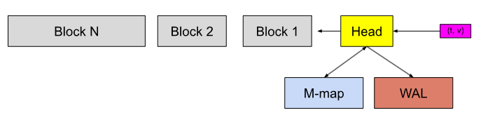
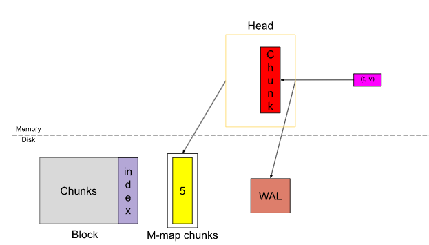

## Вид сверху



Структура базы данных в общем виде - связный список блоков, распределенных во времени. В каноническом виде блоки идут отсортированно по отрезкам [tmin, tmax]. 
Мы будем придерживаться этого правила. 

Как уже ранее было отмечено, мы пока что игнорируем WAL и M-Map и считаем их опциональными. 



Таким образом, MVP структура сводится к следующему: 

- Держим текущие чанки/чанк в памяти 
- Сливаем устарвшие на диск, создаём новые в памяти

## Структуры данных

_Блок_
```
 <block name>
 ├── chunks
 |   ├── 000001
 |   └── 000002
 ├── index
 ├── meta.json
 └── tombstones
```


Блок - агрегат для серий, упавших в промежуток [t0, t1], содержащий в себе:
- meta.json - метаданные для блока (t0, t1, количество серий, чанков, таймстемпов, тип сжатия и тд)

``` Пример meta.json
{
	"ulid": "01EM6Q6A1YPX4G9TEB20J22B2R",
	"minTime": 1602237600000,
	"maxTime": 1602244800000,
	"stats": {
		"numSamples": 553673232,
		"numSeries": 1346066,
		"numChunks": 4440437
	},
	"compaction": {
		"level": 1,
		"sources": [
			"01EM65SHSX4VARXBBHBF0M0FDS",
			"01EM6GAJSYWSQQRDY782EA5ZPN"
		]
	},
	"version": 1
}
```

Вообще, расширение json'а необзятаельно, тут используем какое душе угодно.

- chunk - основной массив данных, в котором записаны пары (timestamp, value) для конкретных серий с конкретным набором лейблов

Magic, версия и паддинг говорят сами за себя, дальше идет массив данных, по чанку.
```
┌──────────────────────────────┐
│    magic() <4 byte>          │
├──────────────────────────────┤
│    version(1) <1 byte>       │
├──────────────────────────────┤
│    padding(0) <3 byte>       │
├──────────────────────────────┤
│ ┌──────────────────────────┐ │
│ │         Chunk 1          │ │
│ ├──────────────────────────┤ │
│ │          ...             │ │
│ ├──────────────────────────┤ │
│ │         Chunk N          │ │
│ └──────────────────────────┘ │
└──────────────────────────────┘

Chunk:
┌───────────────┬───────────────────┬──────────────┬────────────────┐
│ len <uvarint> │ encoding <1 byte> │ data <bytes> │ CRC32 <4 byte> │
└───────────────┴───────────────────┴──────────────┴────────────────┘

Тут длина (uvariant - можно поменять на uint/ulong)
Кодирование, Данные(примерно так: длина, а затем массив (timestamp,value)), CRC32 (можно выкинуть)
```

- index - индекс для ориентирования по chunkам

```
┌────────────────────────────┬─────────────────────┐
│ magic(0xBAAAD700) <4b>     │ version(1) <1 byte> │
├────────────────────────────┴─────────────────────┤
│ ┌──────────────────────────────────────────────┐ │
│ │                 Symbol Table                 │ │
│ ├──────────────────────────────────────────────┤ │
│ │                    Series                    │ │
│ ├──────────────────────────────────────────────┤ │
│ │                   Postings 1                 │ │
│ ├──────────────────────────────────────────────┤ │
│ │                      ...                     │ │
│ ├──────────────────────────────────────────────┤ │
│ │                   Postings N                 │ │
│ ├──────────────────────────────────────────────┤ │
│ │             Postings Offset Table            │ │
│ ├──────────────────────────────────────────────┤ │
│ │                      TOC                     │ │
│ └──────────────────────────────────────────────┘ │
└──────────────────────────────────────────────────┘
```

Где TOC - индекс в индексе:

```
┌─────────────────────────────────────────┐
│ ref(symbols) <8b>                       │ -> Symbol Table
├─────────────────────────────────────────┤
│ ref(series) <8b>                        │ -> Series
├─────────────────────────────────────────┤
│ ref(postings start) <8b>                │ -> Postings 1
├─────────────────────────────────────────┤
│ ref(postings offset table) <8b>         │ -> Postings Offset Table
├─────────────────────────────────────────┤
│ CRC32 <4b> (тоже можно выкинуть)        │
└─────────────────────────────────────────┘
```

Symbol table - кодировка лейблов, названий метрик и их значений в числа:
Хранится лексикографически отсортированной по значениям строк.
```
For example if the series is {a="y", x="b"}, then the symbols would be "a", "b", "x", "y".

┌────────────────────┬─────────────────────┐
│ len <4b>           │ #num symbols <4b>   │
├────────────────────┴─────────────────────┤
│ ┌──────────────────────┬───────────────┐ │
│ │ len(str_1) <uvarint> │ str_1 <bytes> │ │
│ ├──────────────────────┴───────────────┤ │
│ │                . . .                 │ │
│ ├──────────────────────┬───────────────┤ │
│ │ len(str_n) <uvarint> │ str_n <bytes> │ │
│ └──────────────────────┴───────────────┘ │
├──────────────────────────────────────────┤
│ CRC32 <4b>                               │
└──────────────────────────────────────────┘
```

Series - 

```
┌───────────────────────────────────────┐
│ ┌───────────────────────────────────┐ │
│ │   series_1                        │ │
│ ├───────────────────────────────────┤ │
│ │                 . . .             │ │
│ ├───────────────────────────────────┤ │
│ │   series_n                        │ │
│ └───────────────────────────────────┘ │
└───────────────────────────────────────┘

В каждой из линий:

┌──────────────────────────────────────────────────────────────────────────┐
│ len <uvarint>                                                            │
├──────────────────────────────────────────────────────────────────────────┤
│ ┌──────────────────────────────────────────────────────────────────────┐ │
│ │                     labels count <uvarint64>                         │ │
│ ├──────────────────────────────────────────────────────────────────────┤ │
│ │              ┌────────────────────────────────────────────┐          │ │
│ │              │ ref(l_i.name) <uvarint32>                  │          │ │
│ │              ├────────────────────────────────────────────┤          │ │
│ │              │ ref(l_i.value) <uvarint32>                 │          │ │
│ │              └────────────────────────────────────────────┘          │ │
│ │                             ...                                      │ │
│ ├──────────────────────────────────────────────────────────────────────┤ │
│ │                     chunks count <uvarint64>                         │ │
│ ├──────────────────────────────────────────────────────────────────────┤ │
│ │              ┌────────────────────────────────────────────┐          │ │
│ │              │ c_0.mint <varint64>                        │          │ │
│ │              ├────────────────────────────────────────────┤          │ │
│ │              │ c_0.maxt - c_0.mint <uvarint64>            │          │ │
│ │              ├────────────────────────────────────────────┤          │ │
│ │              │ ref(c_0.data) <uvarint64>                  │          │ │
│ │              └────────────────────────────────────────────┘          │ │
│ │              ┌────────────────────────────────────────────┐          │ │
│ │              │ c_i.mint - c_i-1.maxt <uvarint64>          │          │ │
│ │              ├────────────────────────────────────────────┤          │ │
│ │              │ c_i.maxt - c_i.mint <uvarint64>            │          │ │
│ │              ├────────────────────────────────────────────┤          │ │
│ │              │ ref(c_i.data) - ref(c_i-1.data) <varint64> │          │ │
│ │              └────────────────────────────────────────────┘          │ │
│ │                             ...                                      │ │
│ └──────────────────────────────────────────────────────────────────────┘ │
├──────────────────────────────────────────────────────────────────────────┤
│ CRC32 <4b>                                                               │
└──────────────────────────────────────────────────────────────────────────┘

В такой вот прекрасной колбаске лежит следующее, с учётом того, что metric{"a"="b"} и metric{"a"="c"} - разные метрки

labels count - количество пар label=value, закодированный с помощью symbol table,

Далее идут индексы на чанки, они последовательны и зависят друг от друга (без рандомного доступа), в следующем формате:

-t[0]
-t[1] - t[0]
- delta (за исключением первого случая, закодированной информации об положении серии в чанке) 
Кодируется следующим образом - первые 32 бита - номер файла, вторые 32 бита - оффсет.
Из файла видно, что тут применяется дельта-кодирование, поэтому каждый следующий файл это дельта предыдущего (тоже можно опустить для POC)
```

- Postings (обратный индекс):

```
Для одной пары label=value: 
┌────────────────────┬────────────────────┐
│ len <4b>           │ #entries <4b>      │
├────────────────────┴────────────────────┤
│ ┌─────────────────────────────────────┐ │
│ │ ref(series_1) <4b>                  │ │
│ ├─────────────────────────────────────┤ │
│ │ ...                                 │ │
│ ├─────────────────────────────────────┤ │
│ │ ref(series_n) <4b>                  │ │
│ └─────────────────────────────────────┘ │
├─────────────────────────────────────────┤
│ CRC32 <4b>                              │
└─────────────────────────────────────────┘


Имеем две серии {a="b", x="y1"} с ID 120 и {a="b", x="y2"} с ID 145. Для пары a="b" мы сохраним: [120, 145]. Для x="y1": [120], а x="y2": [145].
Важно отметить, что на диске эти списки лежат отсортированными.

Внимательный читатель мог заметить, что в этом списке не хранится, для какой пары были записаны списки. 
Эта информация лежит в Postings Offset Table
```

- Postings Offset Table: 

```
┌─────────────────────┬──────────────────────┐
│ len <4b>            │ #entries <4b>        │
├─────────────────────┴──────────────────────┤
│ ┌────────────────────────────────────────┐ │
│ │  n = 2 <1b>                            │ │
│ ├──────────────────────┬─────────────────┤ │
│ │ len(name) <uvarint>  │ name <bytes>    │ │
│ ├──────────────────────┼─────────────────┤ │
│ │ len(value) <uvarint> │ value <bytes>   │ │
│ ├──────────────────────┴─────────────────┤ │
│ │  offset <uvarint64>                    │ │
│ └────────────────────────────────────────┘ │
│                    . . .                   │
├────────────────────────────────────────────┤
│  CRC32 <4b>                                │
└────────────────────────────────────────────┘

Тут списком хранится следующее - пары label=value в строковом! формате и их оффсет для таблицы Postings. 
```

И, наконец, tombstones: 

```
┌────────────────────────────┬─────────────────────┐
│ magic(0x0130BA30) <4b>     │ version(1) <1 byte> │
├────────────────────────────┴─────────────────────┤
│ ┌──────────────────────────────────────────────┐ │
│ │                Tombstone 1                   │ │
│ ├──────────────────────────────────────────────┤ │
│ │                      ...                     │ │
│ ├──────────────────────────────────────────────┤ │
│ │                Tombstone N                   │ │
│ ├──────────────────────────────────────────────┤ │
│ │                  CRC<4b>                     │ │
│ └──────────────────────────────────────────────┘ │
└──────────────────────────────────────────────────┘

┌────────────────────────┬─────────────────┬─────────────────┐
│ series ref <uvarint64> │ mint <varint64> │ maxt <varint64> │
└────────────────────────┴─────────────────┴─────────────────┘
```

Маркеры удаления промежутка mint;maxt для конкретной серии.

## Связка со сценариями использования

**Чтение блока:**
Дано: [t0,t1], конкретный запрос по метрике my_metric{"a"="b', "c"="d"}

1. Идём по блокам, читая meta.json, с поиском попадания в блок по временной метке (будем считать, что без пересечения)
2. Найдя блок, начинаем читать индекс:
2. 1. Читаем TOC
2. 2. Читаем symbol table
2. 3. Находим оффсет до Posting Offset Table, (опицонально: строим разреженный индекс), ищем оффсет для трех пар: __name__ = "my_metric", a = "b", c = "d"
2. 4. После этого, идём в Postings, ищем для каждой пары список закодированных ID серий, пересекаем между друг другом, получаем финальный список серий. 
2. 5. После этого идём в series и берём нужный оффсет через seriesRef * 16 (там align по шестнадцать байт, поэтому оффсет закодирован в IDшке серии) и наконец находим список для серии.
2. 6. Затем идём и итерируемся, пока не наберем нужный промежуток по данным (пересечения тоже берём), собираем данные, откуда надо прочитать.
3. 1. Идём в чанки и читаем массив (он должен быть отсортированным по временным меткам), забираем метрики.
3. 2. Применяем tombstoneы


**Запись блока**
Дано: Некоторый блок в памяти [t0, t1], связка (t, metric, label1, ..., labelN)

1. Канонизация метрик: название метрики пишется в лейбл __name__
2. Сортируем лексикографически лейблы (дедуплицируем, ставим общий порядок среди всех лейблов)
3. Кодируем лейблы в числа (можно тупо сиквенсом, по индексу)
4. Для каждой серии пишем чанк: сортируем метрики по timestampу, пишем эту конкретную метрику, запоминаем mint, maxt, чанки, в которые легла метрик
5. Потом пишем эти метрики в индекс серии (тут тоже должна быть сортировка), получаем там seriesRef при записи (от align по 16 байт)
6. При записи в Series строим PostingList, строим полный PostingList после записи в серии
7. Построив полный PostingList, начинаем писать их в файл, запоминая оффсеты 
8. Затем пишем Posting File Offset
9. Пишем TOC
10. Пишем meta.json
11. Пишем tombstoneы?
12. Потом магия с атомарной записью, которую решим уже по мере имплементации


**Пропущенные нюансы**
- Не до конца понятно, где и в каком виде должна быть сортировка.
- Детали, связанные с кодированиями файлов (скорее всего просто пропустим)